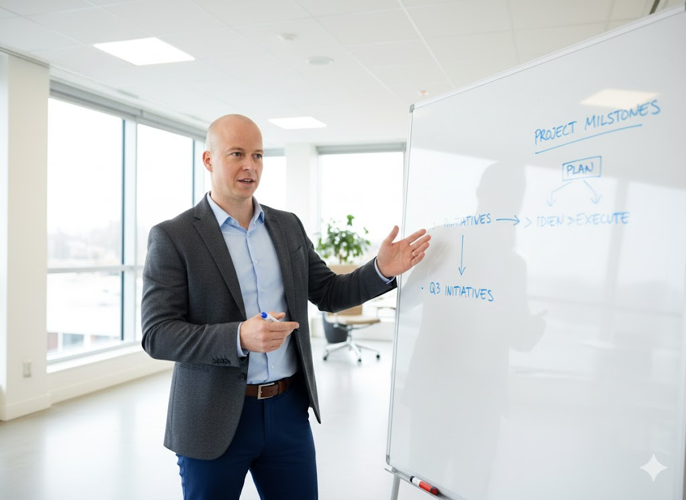

# Career

## 2008
### Backup Team Captain / Backup Agent

This was my first real job, where I first touched a large enterprise IT infrastructure. I took every task seriously and quickly became the top in resolving tickets.
But the work lacked creativity, so it was time for a change.

## 2010
### ID Admin / Service Desk

This role marked my move to Prague, opening the multicultural world of the city to me. The work was monotonous,
broken only by calls from desperate users worldwide struggling with their computers.
The promised technical position never materialized, and I knew I could not stay in this role — it was time to move on.

## 2011
### Software Specialist / Local System Administrator

After two big global companies, I wanted to try a small firm as local admin. Finally, I had my own rack with servers, switches, routers, IP phones, cameras, computers, laptops, and printers.
Later, I also supported our internal customers with kiosk software and did outsourced support for another company. The firm had no processes, so I could use my creativity to build them.
I used my past experience to create my own framework for communication, fixing problems, and training. I felt great in this multi-role job,
traveling across the entire Czech Republic — to small towns for kiosks and big factories as UPS Software Specialist, where I saw real data centers from the inside.
Big milestones were moving firm to a new site and building a network of kiosk terminals. This experiences made me crave work on projects that start in people’s minds and end up in reality.

## 2014
### Technology Consultant

I returned to my roots, to my first employer, but no longer as a user of the ticketing system — now as its creator. I worked on implementing ITSM software for an insurance company and a telecom firm,
culminating in the full migration of an old solution to a new one for the police — a project I led end-to-end on my own. The technology, however, was outdated,
and I once again experienced the stifled processes of a global corporation.

## 2016
### System Administrator

I decided to put the suit away and return to the servers. I took a position as admin at a local internet giant, managing popular services from servers and operating systems to databases,
storage, and even frontend. In this role, I truly found myself. But we couldn’t find a stable fourth team member, and management decided to split our team and services among others.

## 2018
### DevOps

Fortunately, I received an invitation from the recommendation systems team to help them migrate components to Kubernetes. From an admin, I became a developer.
With the team, we started a new era where manual deployments turned into developer routine thanks to automation and orchestration.

## 2020
### Site Reliability Engineer

The company’s IT began transforming from a “everyone does everything” style to highly specialized teams — one for OpenStack, another for Kubernetes, databases, and storage.
When the time came, we proposed that our recommendation systems team would manage our own product ourselves, led by developers.
We gained team recognition for this initiative, and each of us in the team takes on the SRE role from time to time.

## Today
### Infrastructure & Platform Engineer

Today, I handle everything I’ve experienced in my career so far: helping a research colleague troubleshoot a database connection issue, developing CI pipelines,
assisting with migrating our system to a newer infrastructure service version, calculating budgets for services next year,
negotiating with product managers and directors on the technological vision of our system, and occasionally solving operational problems.
