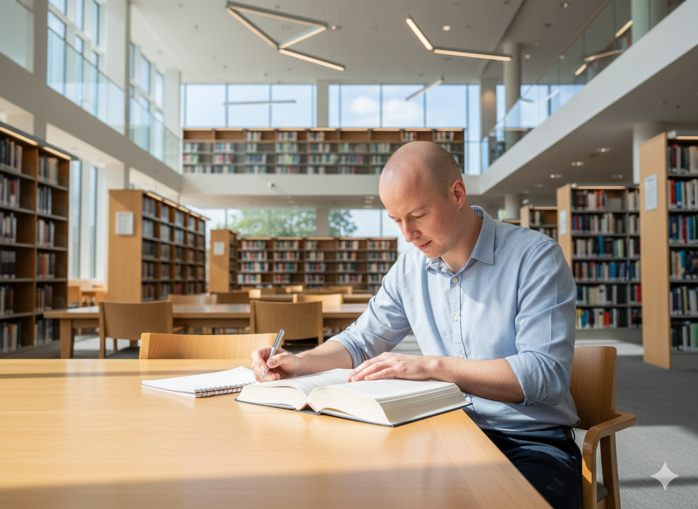

## EDUCATION




At <a href="https://www.galeje.sk" target="_blank">Alejová</a>, I discovered that mathematics is more than a subject — it's a language that underlies all others. Those years shaped how I view the world: as a series of elegant patterns waiting to be understood. Every equation felt like a dialogue with logic itself, and through that dialogue, I learned discipline, patience, and curiosity.



During my time at the <a href="https://www.upjs.sk)" target="_blank">university</a>, I found a way to transform the abstract beauty of mathematics into something practical — communication with machines. Informatics turned numbers into code, and logic into functionality. It was here that problem-solving evolved from a personal challenge to a creative process of building tools that could think alongside me.



At <a href="https://unicornuniversity.net" target="_blank">Unicorn College</a>, I learned that technology's real power lies not only in precision, but in coordination. I discovered how to manage ideas, people, and projects — to turn vision into structured execution. It completed the circle: mathematics gave me logic, informatics gave me language, and project management taught me connection. Each institution, in its way, helped define the professional and person I've become.



